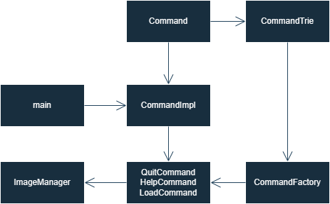

# Pixalyze 
> Real-time image analysis & processing application


## Description
Pixalyze is an easy-to-use command-line application. It allows for the use of an ever-growing collection of commands to analyze and process images.
This application primarily utilizes the OpenCV library to rapidly parse and manipulate images in real-time. 

## Tools 
- __OS:__ Windows 11 64-bit
- __IDE:__ CLion 2024.1.1
- __Compiler:__ Visual Studios 2022 17.0
- __Build Tool:__ CMake 2.28.1
- __Libraries:__ OpenCV 4.9.0

## Installation
To run Pixalyze, open Powershell and enter the following commands:
 ```
  git clone https://github.com/yourusername/your-repo-name.git
  cd your-repo-name/cmake-build-debug
  ./pixalyze
 ```
## Usage
- After running the application, enter 'help' to see the full list of commands
- Enter 'help [command]' to get information on a specific command
### Example usage of the Pixalyze application:<br>


## Commands
### 15+ unique commands to analyze and process your image
- help - List all available commands
- quit - Exit the application
- load - Load image from file path
- reset - Reset modifications made to loaded image
- save - Save loaded image to a new file
- show - Display loaded image in a new window
- faces - Detect all faces in loaded image
- analyze - Display properties of the loaded image
- gray - Convert loaded image from color to grayscale
- color - Convert loaded image from grayscale to color
- blur - Blur the loaded image
- smooth - Smooth the loaded image
- text - Add text to the loaded image
- edges - Apply edge detection to loaded image
- contours - Apply contour detection to loaded image
- histogram - Create histogram plot of pixel values
- ascii - Create ASCII art of loaded image
### Every command is a part of a robust command structure that maximizes efficiency<br><br>


## Contributing
To contribute to Pixalyze, follow these steps:
- ### Install Chocolatey library manager
  - Run Powershell as administrator and run the following command:
  - ```
    Set-ExecutionPolicy Bypass -Scope Process -Force; [System.Net.ServicePointManager]::SecurityProtocol = [System.Net.ServicePointManager]::SecurityProtocol -bor 3072; iex ((New-Object System.Net.WebClient).DownloadString('https://community.chocolatey.org/install.ps1'))
- ### Install OpenCV library
  - Run Powershell as administrator and run the following command:
  - ```
    choco install opencv   
- ### Set up system & environment variables
  - Open 'Environment Variables,' and add the following system variables:
  - ```
    OPENCV_DIR           | C:\tools\opencv\build\x64\vc14\lib
    OPENCV_INCLUDE_PATHS | C:\tools\opencv\build\include
    OPENCV_LINK_LIBS     | opencv_world460
    OPENCV_LINK_PATHS    | C:\tools\opencv\build\x64\vc15\lib
    OPENCV_PATH          | C:\tools\opencv
  - Double-click on 'PATH' and add the following environment variable: 
  - ```
    User Variables / Path / C:\tools\opencv\build\x64\vc15\bin
After those steps, clone the repository per the installation instructions and open the project in your IDE.
